# 2017 OCT 

## Temperature

### <Final Guidance for Korean Seasonal Prediction>
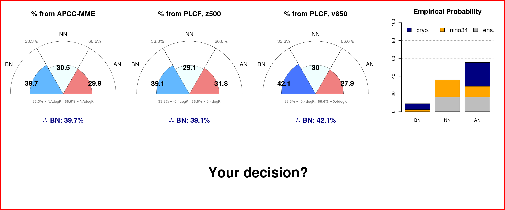

### 1. Past MME predictions
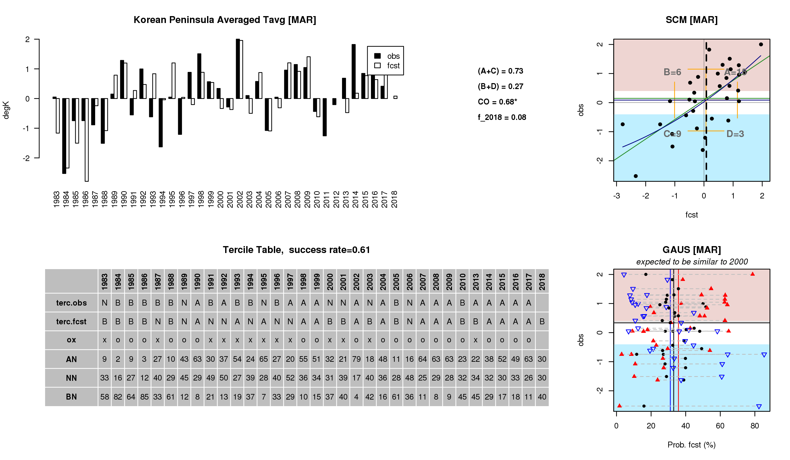

### 2. Info. from individula models
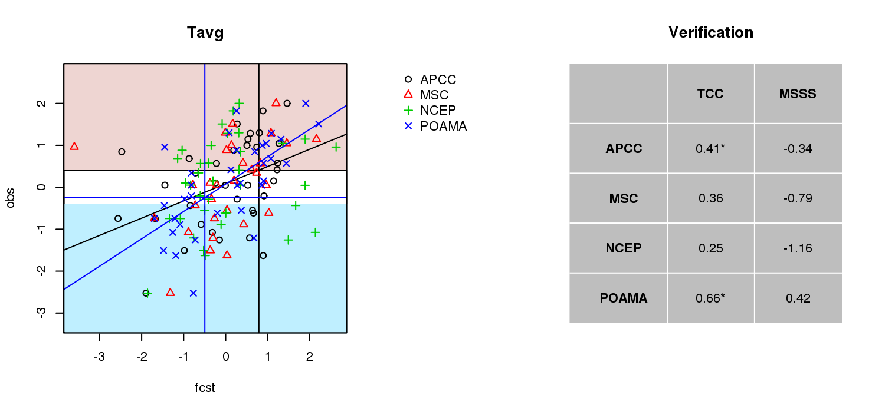

### 3. Info. from ENSO
- Biases under specific ENSO condition 

- Delayed ENSO response 
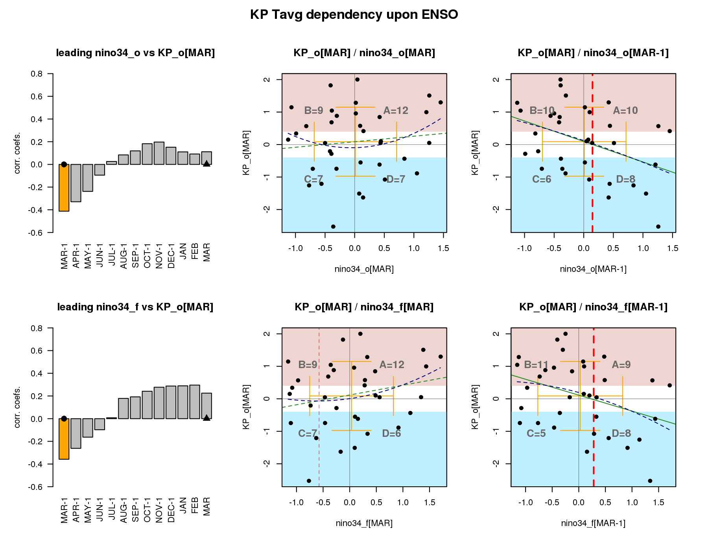

### 4. Connection to Cryosphere 
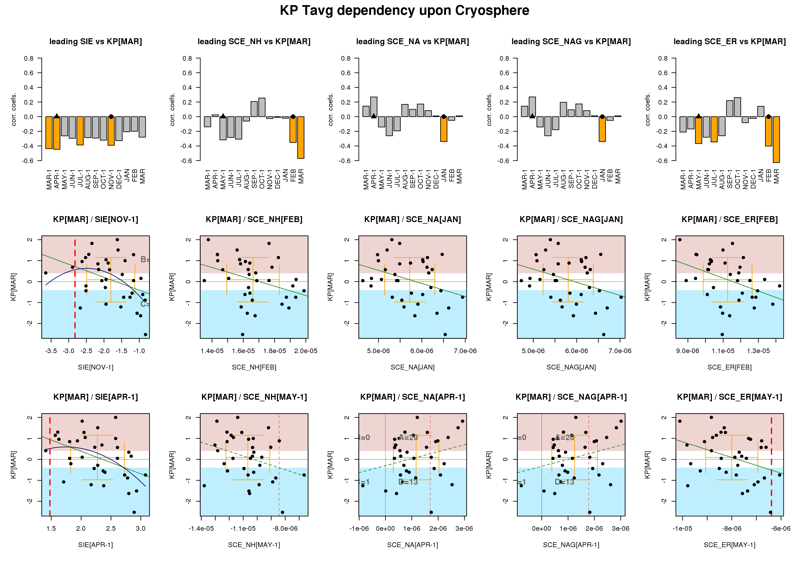

### 5. Large Scale Ciruclation based DSP tailoring
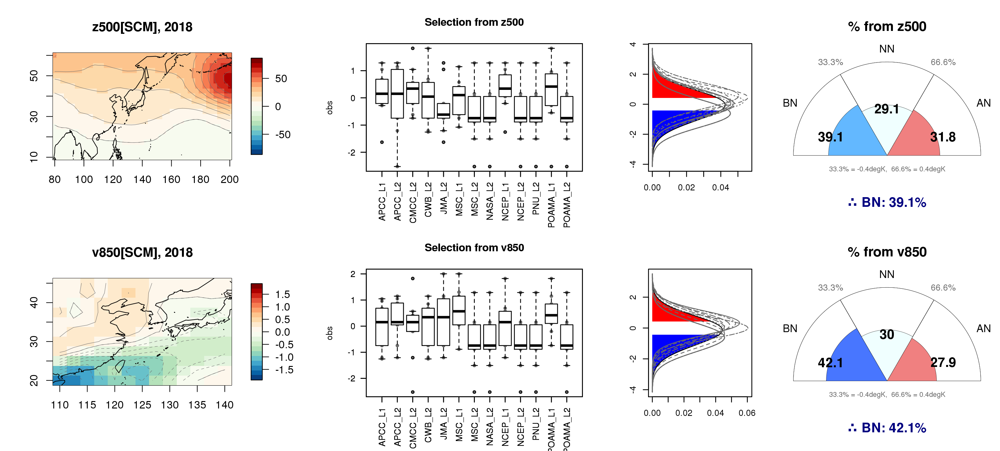

## 
## Rain

### <Final Guidance for Korean Seasonal Prediction>
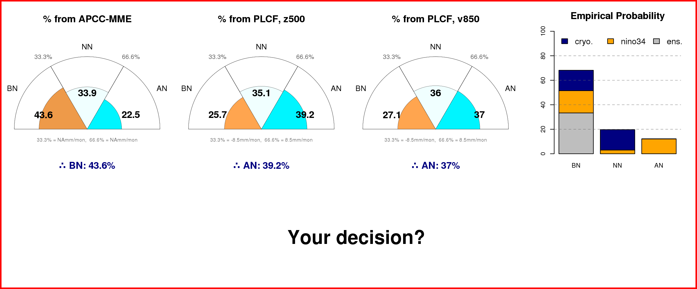

### 1. Past MME predictions
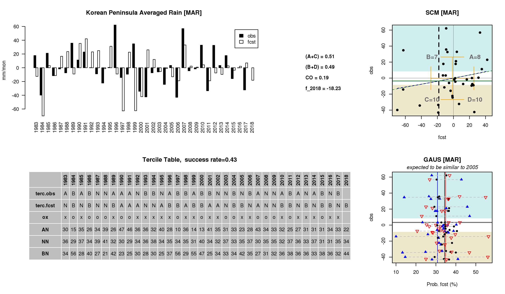

### 2. Info. from individula models
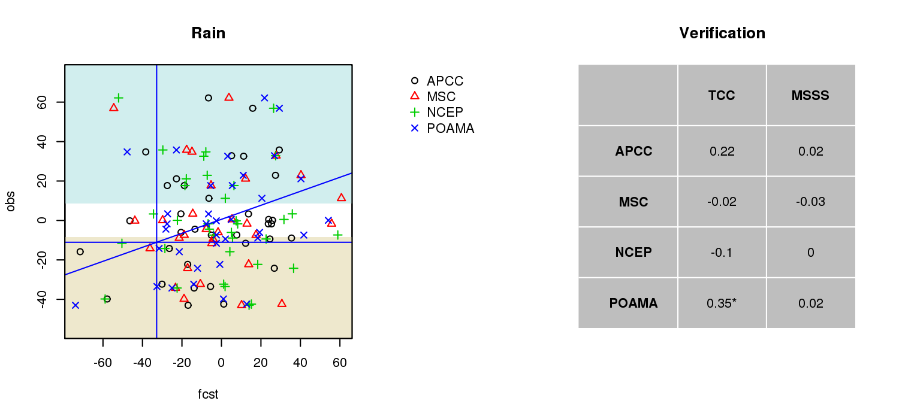

### 3. Info. from ENSO
- Biases under specific ENSO condition 
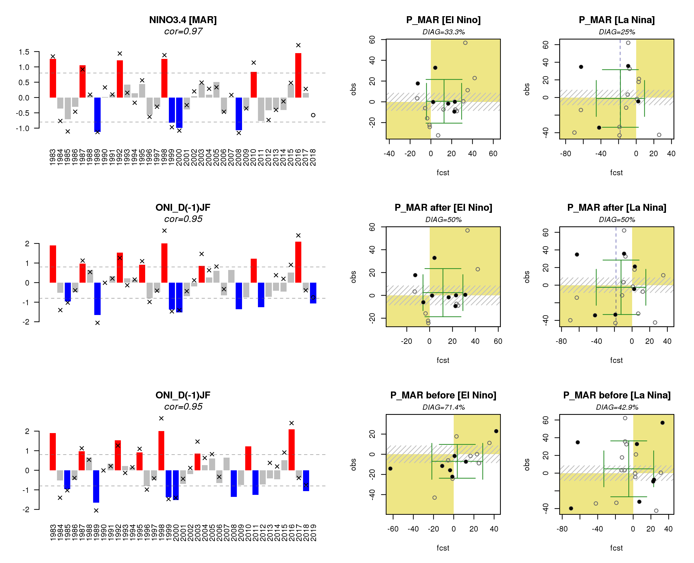

- Delayed ENSO response 
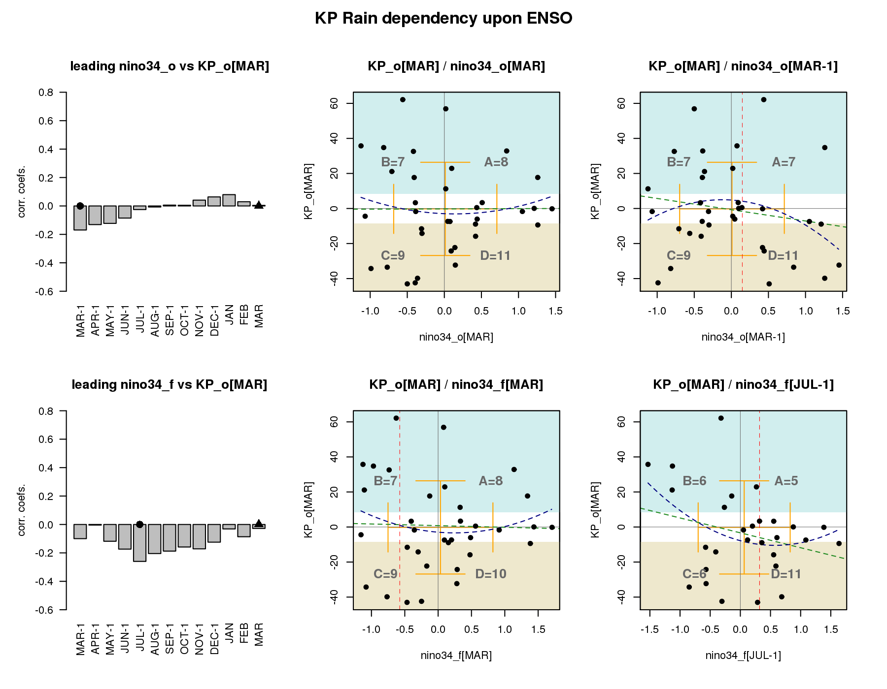

### 4. Connection to Cryosphere 
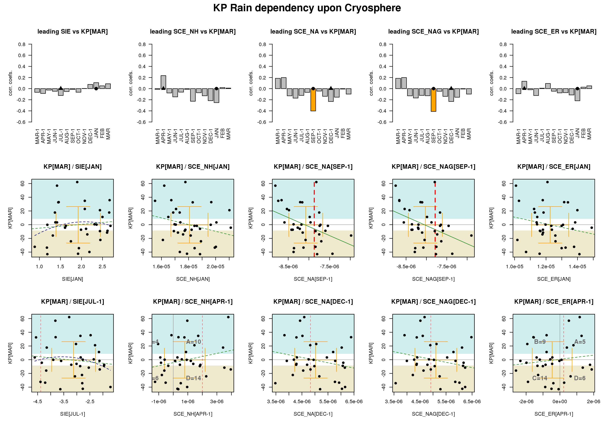

### 5. Large Scale Ciruclation based DSP tailoring
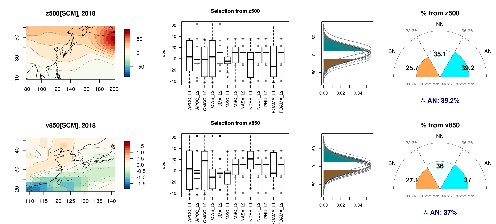

